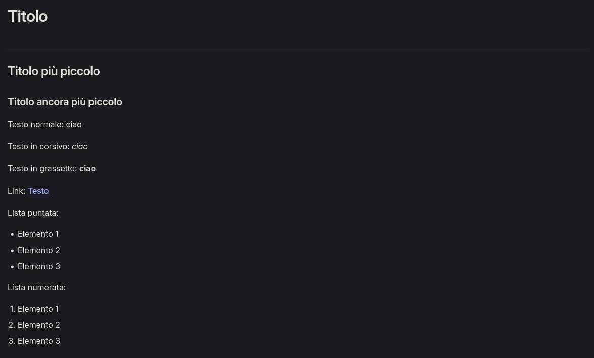

# Studenti Montanari

[MontanariUnito](https://MontanariUnito.github.io/) è un sito creato dagli
studenti dell'istituto Montanari.
È stato creato con [Vitepress](https://vitepress.dev/).

## Come contribuire

### Struttura

Il sito si trova nella cartella `site`. Ogni file `.md` viene convertito in una
pagina del sito.

Per esempio:

- `site/ciao.md` si troverà a `https://MontanariUnito.github.io/ciao`
- `site/cartella/file.md` si troverà a `https://MontanariUnito.github.io/cartella/file`

I file `index.md` rappresentano la pagina principale di una cartella:

- `site/index.md` -> `https://MontanariUnito.github.io/`
- `site/cartella/index.md` -> `https://MontanariUnito.github.io/cartella/`

### Linguaggio

Le pagine sono scritte in **Markdown**, un formato semplice per scrivere documenti.
Ecco come scriverlo:

```md
# Titolo

## Titolo più piccolo

### Titolo ancora più piccolo

Testo normale: ciao

Testo in corsivo: _ciao_

Testo in grassetto: **ciao**

Link: [Testo](https://example.com)

Lista puntata:

- Elemento 1
- Elemento 2
- Elemento 3

Lista numerata:

1. Elemento 1
2. Elemento 2
3. Elemento 3
```

Risultato:


> [!warning] Attenzione
> Se non mettete righe vuote tra i diversi paragrafi, Markdown le toglierà e
> risulterà tutto sulla stessa riga! Lasciate sempre righe vuote dove volete che
> si interrompano le righe!

### Contribuire

Ci sono due modi con i quali potete contribuire al sito:

1. Potete creare una pagina da aggiungere al sito sul vostro PC, scrivere il
   Markdown se volete, poi mandarla ad uno degli studenti che gestisce il sito e
   lasciare che lui stesso la carichi e sistemi il Markdown.
2. Potete utilizzare `git` per clonare l'intero sito sul vostro PC, aggiungere
   la pagina voi stessi, testarla con `npm`, e poi usare `git` per caricarla
   direttamente sul sito.

### Scrivere Markdown

Esistono editor online come [Online Markdown](https://onlinemarkdown.com/) che
vi permettono di scrivere documenti in Markdown in modo semplice.
Se volete contribuire col primo modo, questo è il mezzo più semplice.
Se invece, volete qualcosa di più potente, o volete modificare direttamente il
source code del sito e poi pushare con `git`, potete usare VSCode:

- Scaricate VSCode da [qui](https://code.visualstudio.com/download/)
- Apritelo. Nella barra a sinistra, cliccate sull'icona delle estensioni.
- Cercate e scaricate `Prettier` e `Markdown Preview Enhanced`
- Nella barra a sinistra aprite il file explorer, poi "Apri Cartella"
- Create un file (click destro nel file explorer -> "Nuovo file")
- Chiamatelo `qualcosa.md`
- Scrivete il documento
- Premete Alt+Shift+F (Windows) o Ctrl+Shift+I (Linux) per formattarlo
- Premete Ctrl+K e poi V per aprire l'anteprima del documento
